# business-performance-analytics-layer

**Advanced SQL portfolio project** that builds a miniature data warehouse and two production-ready analytical reports (Customers & Products) using **T-SQL** only. The repo shows how to design bronze/silver/gold layers, engineer KPIs with **window functions & CTEs**, and publish clean **reporting views** any BI tool can consume.

---

## Highlights

* End-to-end SQL ownership: ingest → model → analyze → publish
* Clear warehouse layering (**bronze/silver/gold**) and naming standards
* Advanced analytics: trend/change over time, cumulative/running totals, YoY/MoM performance, segmentation, part-to-whole shares
* Production deliverables: `gold.report_customers` and `gold.report_products` views with documented KPIs

---

## Data & Architecture

This repo implements the **Medallion** pattern in **SQL Server (T-SQL)**:


```
bronze  →  raw CSV extracts (CRM & ERP)
silver  →  cleaned/retyped CSVs (one-to-one with bronze)
gold    →  star schema tables + final reporting views
```

**Gold tables**

* `gold.dim_customers` — conformed customer attributes
* `gold.dim_products` — product catalog, category, subcategory, cost
* `gold.fact_sales` — atomic sales lines with dates, amounts, qty

**Gold reporting views**

* `gold.report_customers`
* `gold.report_products`

> All logic is implemented in SQL; no external ETL required.

---

## Gold ERD (star schema)

```mermaid
erDiagram
  dim_customers ||--o{ fact_sales : has
  dim_products  ||--o{ fact_sales : has

  dim_customers {
    int    customer_key PK
    string customer_number
    string customer_name
    int    age
  }

  dim_products {
    int     product_key PK
    string  product_name
    string  category
    string  subcategory
    decimal cost
  }

  fact_sales {
    int     order_number
    date    order_date
    int     customer_key FK
    int     product_key FK
    int     quantity
    decimal sales_amount
  }
```



---

## Key SQL Techniques

* **Window functions**: `SUM() OVER`, `AVG() OVER`, `LAG()`, `ROW_NUMBER()`
* **Performance comparisons**: YoY/MoM via `LAG` and date bucketing (`YEAR()`, `MONTH()`)
* **Cumulative metrics**: running totals, moving averages
* **Segmentation**: `CASE WHEN` to create spend tiers, age bands, cost ranges
* **Part-to-whole**: category share of total sales
* **CTEs**: layered, readable transformations
* **KPI engineering**: `DATEDIFF`/`GETDATE()` for recency & lifespans; defensive divide-by-zero guards

---

## Repository Structure

```
datasets/
  csv-files/
    bronze.crm_cust_info.csv
    bronze.crm_prd_info.csv
    bronze.crm_sales_details.csv
    bronze.erp_cust_az12.csv
    bronze.erp_loc_a101.csv
    bronze.erp_px_cat_g1v2.csv
    silver.crm_cust_info.csv
    silver.crm_prd_info.csv
    silver.crm_sales_details.csv
    silver.erp_cust_az12.csv
    silver.erp_loc_a101.csv
    silver.erp_px_cat_g1v2.csv
    gold.dim_customers.csv
    gold.dim_products.csv
    gold.fact_sales.csv
    gold.report_customers.csv
    gold.report_products.csv
  DataWarehouseAnalytics.bak   ← ready-to-restore SQL Server backup

scripts/
  00_init_database.sql
  01_database_exploration.sql
  02_dimensions_exploration.sql
  03_date_range_exploration.sql
  04_measures_exploration.sql
  05_magnitude_analysis.sql
  06_ranking_analysis.sql
  07_change_over_time_analysis.sql
  08_cumulative_analysis.sql
  09_performance_analysis.sql
  10_data_segmentation.sql
  11_part_to_whole_analysis.sql
  12_report_customers.sql
  13_report_products.sql
```

---

## Quickstart

**Prerequisites:** SQL Server 2019+ (Express/Developer) and SQL Server Management Studio (**SSMS**).

**Tested on:** SQL Server **2019/2022** (Developer/Express), **SSMS 20.x**

### Option A — Restore the ready DB (fastest)

1. Copy `datasets/DataWarehouseAnalytics.bak` to your SQL Server backup folder (e.g., `C:\Program Files\Microsoft SQL Server\<instance>\MSSQL\Backup`).
2. In SSMS: **Databases → Restore Database… → Device → Add** the `.bak` → **OK**.
3. Confirm you see database **`DataWarehouseAnalytics`** with schema **`gold`**.

### Option B — Create from scripts

1. Run `scripts/00_init_database.sql` (creates DB, schemas, and core tables).
2. Import the CSVs (SSMS “Import Flat File…” or `BULK INSERT`) into matching tables.
3. Run exploration/analysis scripts as needed.

### Build the Reports (production views)

> In SSMS and `sqlcmd`, `:r` includes a file; in SSMS you can also just open each script and press **Execute**.

```sql
-- Customer 360 report
:r .\scripts\12_report_customers.sql

-- Product performance report
:r .\scripts\13_report_products.sql
```

Smoke test:

```sql
SELECT TOP (50) * FROM gold.report_customers ORDER BY total_sales DESC;
SELECT TOP (50) * FROM gold.report_products  ORDER BY total_sales DESC;
```

---

## Reports

### `gold.report_customers`

* **Identity**: `customer_key`, `customer_number`, `customer_name`, `age`, `age_group`
* **Segmentation**: `customer_segment` (VIP / Regular / New)

  * **VIP**: `lifespan_months ≥ 12` **and** `total_sales > 5000`
  * **Regular**: `lifespan_months ≥ 12` **and** `total_sales ≤ 5000`
  * **New**: `lifespan_months < 12`
* **Core metrics**:
  `total_orders`, `total_sales`, `total_quantity`, `total_products`,
  `last_order_date`, `lifespan_months`
* **KPIs**:
  `recency_months` (months since last order),
  `avg_order_value` (guarded),
  `avg_monthly_spend` (lifespan-aware)

### `gold.report_products`

* **Identity**: `product_key`, `product_name`, `category`, `subcategory`, `cost`
* **Segmentation**: `revenue_band` (High / Mid / Low) by total\_sales thresholds
* **Core metrics**:
  `total_orders`, `total_sales`, `total_quantity`, `total_customers`,
  `avg_selling_price` (= sales / quantity), `last_sale_date`, `lifespan_months`
* **KPIs**:
  `avg_order_revenue` (= sales / orders, guarded),
  `avg_monthly_revenue` (= sales / lifespan, lifespan-aware)

---

## KPI Dictionary

### Customers

| KPI                 | Definition                                                                          | Notes            |
| ------------------- | ----------------------------------------------------------------------------------- | ---------------- |
| `total_orders`      | `COUNT(DISTINCT order_number)`                                                      | per customer     |
| `total_sales`       | `SUM(sales_amount)`                                                                 | dataset currency |
| `total_quantity`    | `SUM(quantity)`                                                                     | units            |
| `total_products`    | `COUNT(DISTINCT product_key)`                                                       | product breadth  |
| `last_order_date`   | `MAX(order_date)`                                                                   | —                |
| `lifespan_months`   | `DATEDIFF(MONTH, MIN(order_date), MAX(order_date))`                                 | floor months     |
| `recency_months`    | `DATEDIFF(MONTH, last_order_date, GETDATE())`                                       | activity signal  |
| `avg_order_value`   | `total_sales / NULLIF(total_orders, 0)`                                             | guarded divide   |
| `avg_monthly_spend` | `CASE WHEN lifespan_months=0 THEN total_sales ELSE total_sales/lifespan_months END` | lifespan-aware   |
| `customer_segment`  | VIP / Regular / New                                                                 | rules above      |

### Products

| KPI                   | Definition                                                                          | Notes                        |
| --------------------- | ----------------------------------------------------------------------------------- | ---------------------------- |
| `total_orders`        | `COUNT(DISTINCT order_number)`                                                      | per product                  |
| `total_sales`         | `SUM(sales_amount)`                                                                 | —                            |
| `total_quantity`      | `SUM(quantity)`                                                                     | —                            |
| `total_customers`     | `COUNT(DISTINCT customer_key)`                                                      | reach                        |
| `avg_selling_price`   | `total_sales / NULLIF(total_quantity, 0)`                                           | guarded                      |
| `last_sale_date`      | `MAX(order_date)`                                                                   | —                            |
| `lifespan_months`     | `DATEDIFF(MONTH, MIN(order_date), MAX(order_date))`                                 | —                            |
| `avg_order_revenue`   | `total_sales / NULLIF(total_orders, 0)`                                             | —                            |
| `avg_monthly_revenue` | `CASE WHEN lifespan_months=0 THEN total_sales ELSE total_sales/lifespan_months END` | —                            |
| `revenue_band`        | High / Mid / Low                                                                    | thresholded on `total_sales` |

---

## Example Analyses

**Year-over-Year product performance (YoY)**

```sql
WITH yearly AS (
  SELECT
    p.product_name,
    YEAR(f.order_date) AS order_year,
    SUM(f.sales_amount) AS sales_year
  FROM gold.fact_sales f
  JOIN gold.dim_products p ON p.product_key = f.product_key
  WHERE f.order_date IS NOT NULL
  GROUP BY p.product_name, YEAR(f.order_date)
)
SELECT
  product_name,
  order_year,
  sales_year,
  sales_year
    - LAG(sales_year) OVER (PARTITION BY product_name ORDER BY order_year) AS yoy_change
FROM yearly
ORDER BY product_name, order_year;
```

**Part-to-whole: category share of total sales**

```sql
WITH cat AS (
  SELECT p.category, SUM(f.sales_amount) AS sales_cat
  FROM gold.fact_sales f
  JOIN gold.dim_products p ON p.product_key = f.product_key
  GROUP BY p.category
)
SELECT
  category,
  sales_cat,
  CAST(100.0 * sales_cat / SUM(sales_cat) OVER () AS DECIMAL(5,2)) AS pct_of_total
FROM cat
ORDER BY sales_cat DESC;
```

**Customer retention targeting (high risk = long recency, low lifespan)**

```sql
SELECT TOP (100)
  customer_key, customer_name, customer_segment,
  total_sales, recency_months, lifespan_months, avg_monthly_spend
FROM gold.report_customers
WHERE recency_months >= 6
ORDER BY recency_months DESC, avg_monthly_spend ASC;
```

---

## Loading CSVs (if you don’t restore the .bak)

**Import Wizard:** SSMS → Database → Tasks → **Import Flat File** → map each CSV to the matching table.

**Or BULK INSERT (example):**

```sql
BULK INSERT gold.fact_sales
FROM 'C:\path\to\datasets\csv-files\gold.fact_sales.csv'
WITH (FIRSTROW = 2, FIELDTERMINATOR = ',', ROWTERMINATOR = '0x0a', TABLOCK);
```

> Adjust paths and target tables for each CSV. For bronze/silver CSVs, load them into staging then upsert into gold.

---

## Compatibility

* **SQL Server:** 2019 / 2022
* **SSMS:** 20.x
* Works with Express or Developer editions.

---

## Credits

Dataset & inspiration based on a synthetic retail scenario. All SQL written to be vendor-portable but tested with **SQL Server**.

**Author:** Daryll Giovanny Bikak Mbal 
